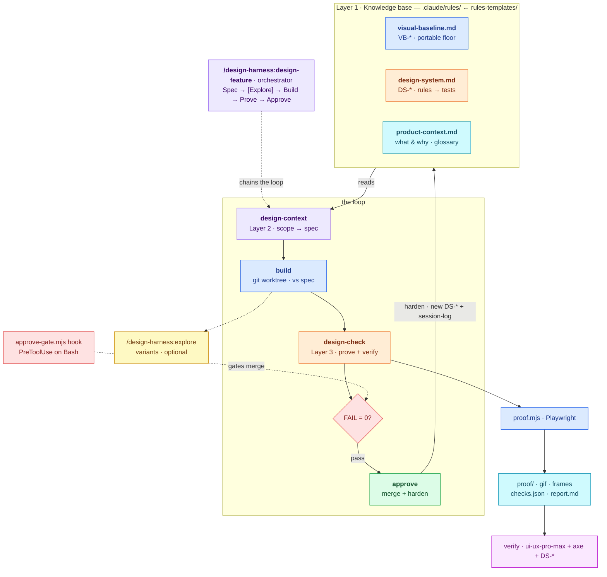

<div align="center">

# design-harness

**Agentic design harness for Claude Code** — explore complex UI, build it on isolated
worktrees, **prove it with Playwright**, and harden a design system that doubles as a
test suite.

<p>
  
  
  
  
  
</p>

</div>

`design-harness` is a **Claude Code plugin**: a bundle of skills, slash commands,
hooks, and one Playwright script that turns UI work into a repeatable
sense → build → prove → approve loop — where every approval feeds learnings back
into the rules. The only code is `scripts/proof.mjs`; everything else is markdown
that steers Claude.

> **Command namespace.** Plugin commands and skills are namespaced under the plugin
> name, so every invocation is prefixed with `design-harness:` — e.g.
> `/design-harness:approve`.

## Architecture



## The three layers

| Layer | Job | How it's encoded |
|------|-----|------------------|
| **1 · Visual** | A portable baseline + an evolving design system that hardens into a test suite | `CLAUDE.md` (always-on) + `rules/visual-baseline.md` + `rules/design-system.md` |
| **2 · Context** | Sense new work, interrogate you, fan out variants before converging | `design-context` skill (auto-fires) + `/design-harness:explore` + `rules/product-context.md` |
| **3 · Agentic** | Build on a worktree → prove → verify → approve, then loop learnings back up | `design-check` skill + `/design-harness:approve` + `hooks/` + `scripts/proof.mjs` |

## Install

```bash
# point Claude Code at the marketplace (local path, or a GitHub <owner>/<repo>)
claude plugin marketplace add /absolute/path/to/design-harness-marketplace

# install the plugin (project scope shares it with your team via .claude/)
claude plugin install design-harness@design-harness-marketplace --scope project
```

Then copy the rule templates into your repo, wire the `CLAUDE.md` snippet, and
install the proof toolchain (`npm i -D playwright && npx playwright install chromium`).
Full steps in [INSTALL.md](design-harness-marketplace/design-harness/INSTALL.md).

## Commands & skills

Every invocation is prefixed with `design-harness:`.

- **`/design-harness:design-feature <seed>`** — run the whole workflow end to end (resume-safe).
- **`design-context`** (skill) — grounds new work in the rules, asks what's unknown, writes the spec.
- **`/design-harness:explore <thing> [n=3]`** — fan out N distinct variants, compare, reconverge.
- **`/design-harness:design-check`** (skill) — capture a Playwright proof, verify, write the report.
- **`/design-harness:approve [note]`** — merge the worktree, log, and fold learnings into the rules.

## Documentation

- **[Plugin README](design-harness-marketplace/design-harness/README.md)** — full overview, architecture, and component reference.
- **[INSTALL.md](design-harness-marketplace/design-harness/INSTALL.md)** — setup & first run.
- **[USAGE.md](design-harness-marketplace/design-harness/USAGE.md)** — one-page quickstart + build modes.

## Repository layout

```
design-harness/                          ← this repo
├─ LICENSE                               MIT
├─ README.md                             ← you are here
└─ design-harness-marketplace/           the Claude Code marketplace
   ├─ .claude-plugin/marketplace.json
   └─ design-harness/                    the plugin
      ├─ .claude-plugin/plugin.json
      ├─ skills/  commands/  hooks/  scripts/
      ├─ rules-templates/  templates/
      └─ README.md · INSTALL.md · USAGE.md
```

## License

MIT © 2026 Visal Medepalli. See [LICENSE](LICENSE).
